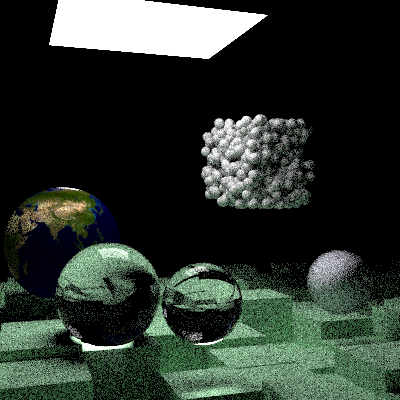

# RT_project

A primitive ray-tracer written in CUDA.

## Current status

- Forked from [Ray Tracing: The Next Week](https://raytracing.github.io/books/RayTracingTheNextWeek.html) 
with minimal modifications to provide a baseline.
- Working CUDA implementation (except image texture) with recursive function call



### Frame time

Debug scene, 400x400 px, 32 samples per pixel, depth of ray is 4.

- AMD Ryzen 9 7940HS 8c16t: ~113 ms.
- NVIDIA GeForce RTX 4060 Laptop GPU: ~15.2 ms.

## How-to

### Debug
```shell
compute-sanitizer.bat .\RT_project.exe
```

### Build
Use `CMake` and `vcpkg`.

### Run
Run with any arguments for `.ppm` output:
```shell
RT_project.exe XXX > render.ppm
```

Run directly for real-time display output:
```shell
RT_project.exe
```