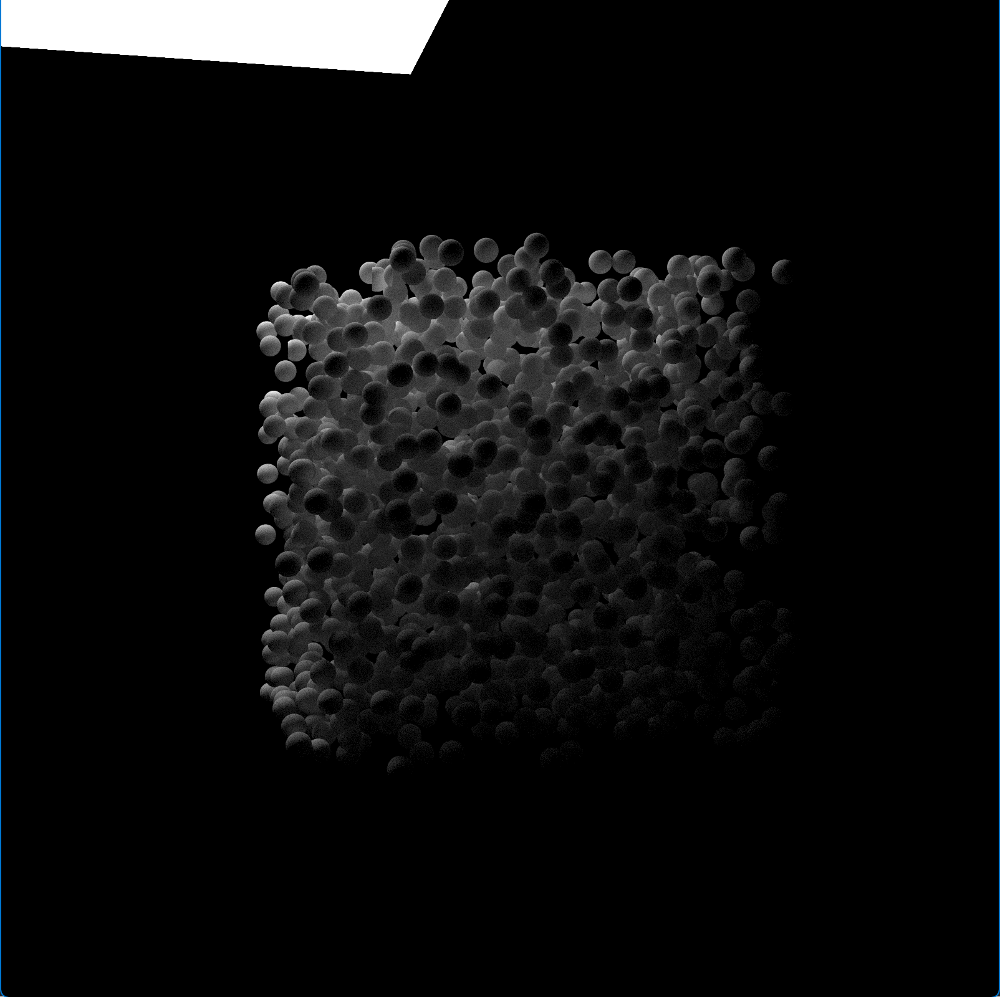

# RT_project

A primitive ray-tracer written in CUDA.

## Current status

- Forked from [Ray Tracing: The Next Week](https://raytracing.github.io/books/RayTracingTheNextWeek.html) 
with minimal modifications to provide a baseline.
- Working CUDA implementation with loop-based function calls

Reference render: 1600x1600 px, 1024 samples per pixel, depth of ray is 8.


### Frame time

Controlled test scene (same as the reference render above), 400x400 px, 32 samples per pixel, depth of ray is 4.

- AMD Ryzen 9 7940HS 8c16t: \~459.2 ms.
- NVIDIA GeForce RTX 4060 Laptop GPU: \~119.5 ms.

## How-to

### Debug
```shell
compute-sanitizer.bat .\RT_project.exe
```

### Build
Use `CMake` and `vcpkg`.

### Run
Run with default arguments for real-time display output:
```shell
RT_project.exe
```

Run with arguments for real-time display output:
```shell
RT_project.exe --size <int> --depth <int> --samples <int> --frame <int>
```